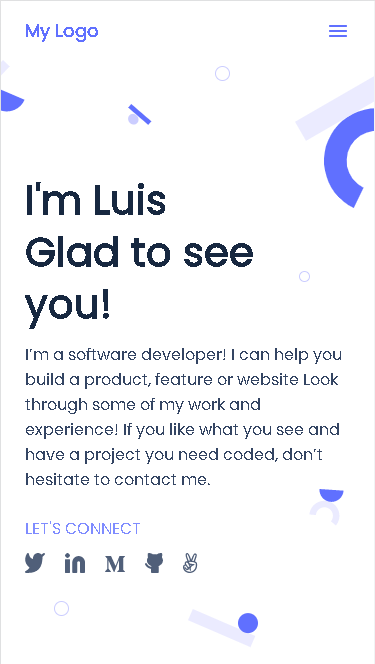

# Portfolio

> This is a responsive portfolio project whose is still a work in progress.



The style of this project is based on Template 1 from Microverse's Figma.com styles.

## Built With

- HTML
- CSS
- node.js (for the linters)

## Live Demo

[Live Demo Link](https://lfmnovaes.github.io/portfolio/)

## Getting Started

- Run git clone on this project at the desired directory:
   ```
   git clone https://github.com/lfmnovaes/portfolio.git
   ```
- Open the index.html in your favorite browser
- Right-click on the website and go to Inspect (Google Chrome) or Inspect Element (Firefox)
- Best fit on 1024p screen or higher or any mobile version with 375p/360p screen

### Prerequisites

An updated web browser

### Usage

- Open the website with any Browser (preferably with Google Chrome)
- Scroll down to see different sections of the page

## Authors

👤 **Luís Fernando**

- GitHub: [](https://github.com/lfmnovaes)
- Twitter: [](https://www.twitter.com/lfmnovaes/)
- LinkedIn: [](https://www.linkedin.com/in/lfmnovaes/)

## 🤝 Contributing

👤 **Chukwuebuka Victor Ozoede**

- GitHub: [@chukwuebukaVictor](https://github.com/chukwuebukaVictor)
- Twitter: [@OzoedeVictor](https://twitter.com/OzoedeVictor)
- LinkedIn: [LinkedIn](www.linkedin.com/in/chukwuebuka-ozoede-46616a219)

Contributions, issues, and feature requests are welcome!

Feel free to check the [issues page](../../issues/).

## Show your support

Give a ⭐️ if you like this project!

## Acknowledgments

To Microverse and their support team.

## 📝 License

This project is [MIT](./MIT.md) licensed.
