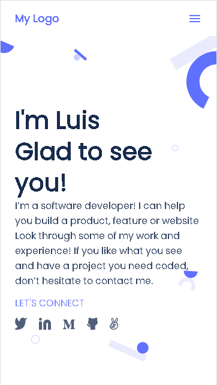

# Portfolio

> This is a responsive portfolio project whose is still a work in progress.



The style of this project is based on Template 1 from Microverse's Figma.com styles.

## Built With

- HTML
- CSS
- node.js (for the linters)

## Live Demo

[Live Demo Link](https://lfmnovaes.github.io/portfolio/)

## Getting Started

- Run git clone on this project at the desired directory:
   ```
   git clone https://github.com/lfmnovaes/portfolio.git
   ```
- Open the index.html on your favorite browser
- Right click in the website and go to Inspect (Google Chrome) or Inspect Element (Firefox)
- Switch to any mobile version with 360px width

### Prerequisites

Working only for mobile version (best fit in 360x640)

### Usage

Open the website with any Browser (preferably with Google Chrome).

## Authors

👤 **Luís Fernando**

- GitHub: [@lfmnovaes](https://github.com/lfmnovaes)
- Twitter: [@lfmnovaes](https://twitter.com/lfmnovaes)
- LinkedIn: [LinkedIn](https://www.linkedin.com/in/lfmnovaes/)

## 🤝 Contributing

👤 **Chukwuebuka Victor Ozoede**

- GitHub: [@chukwuebukaVictor](https://github.com/chukwuebukaVictor)
- Twitter: [@OzoedeVictor](https://twitter.com/OzoedeVictor)
- LinkedIn: [LinkedIn](www.linkedin.com/in/chukwuebuka-ozoede-46616a219)

Contributions, issues, and feature requests are welcome!

Feel free to check the [issues page](../../issues/).

## Show your support

Give a ⭐️ if you like this project!

## Acknowledgments

To Microverse and their support team.

## 📝 License

This project is [MIT](./MIT.md) licensed.